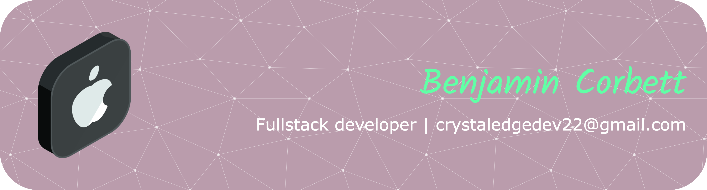

## Full Stack Developer | Cloud Solutions | AI Integration

Full-Stack Software Developer specializing in modern web technologies and AI-powered solutions. I build secure and responsive applications with React and Next.js, develop scalable backend systems with Node.js, Express, Python, and .NET, and integrate AI agents and RAG solutions into production applications.

### Tech Stack

### Core Technologies

**Frontend**  
React | Redux | Next.js | TypeScript | JavaScript | TailwindCSS | Bootstrap | Angular

**Backend**  
Node.js | Express.js | C# | .NET | Python

**Databases**  
MongoDB | PostgreSQL | SQL | Cosmos DB | NoSQL

**Cloud**  
AWS | Azure | Google Cloud Platform

**Development**
Docker | Git | Claude | ChatGPT

**AI & Machine Learning**  
LangChain | Pydantic AI | OpenAI API | Langfuse | RAG Systems | Vector Databases

### Connect
[**LinkedIn**](https://www.linkedin.com/in/corbett-benjamin/)

[**Portfolio**](https://www.benjamincorbettnj.dev/)

**Email:** ben.corbett@benjamincorbettnj.dev  

